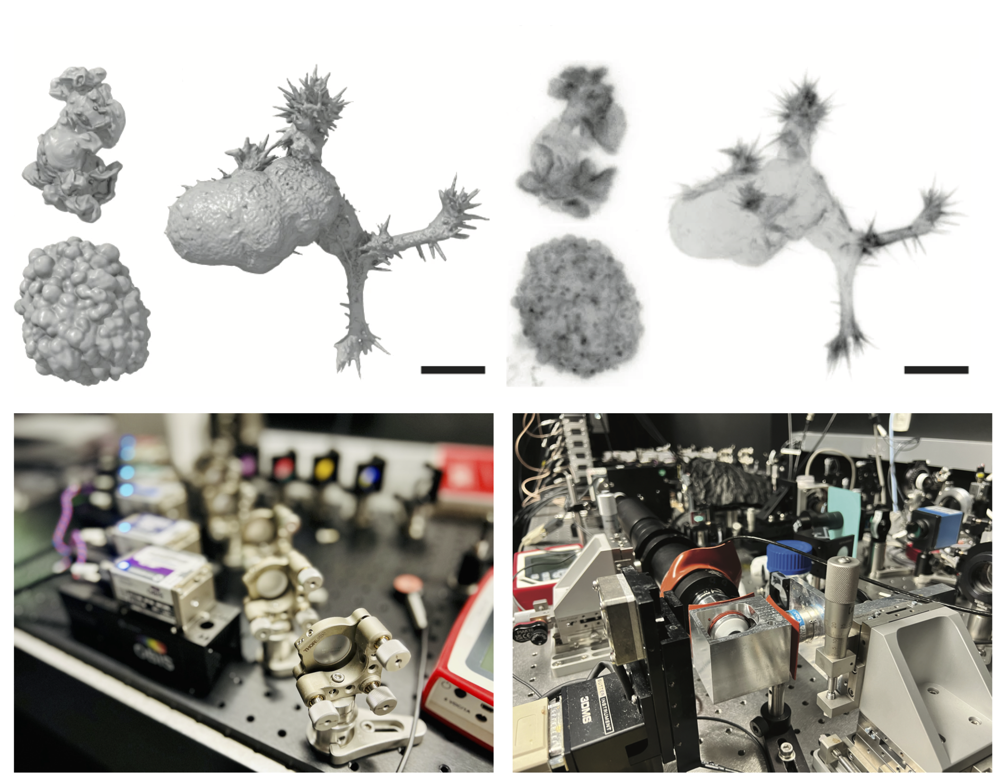
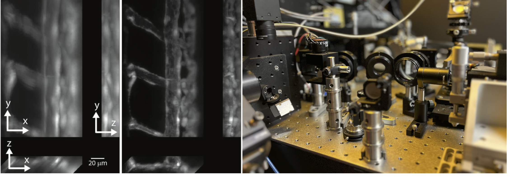
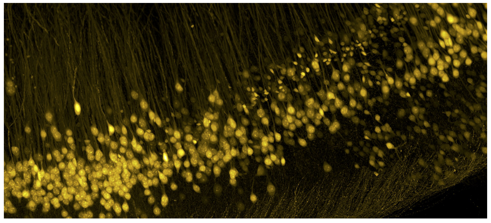
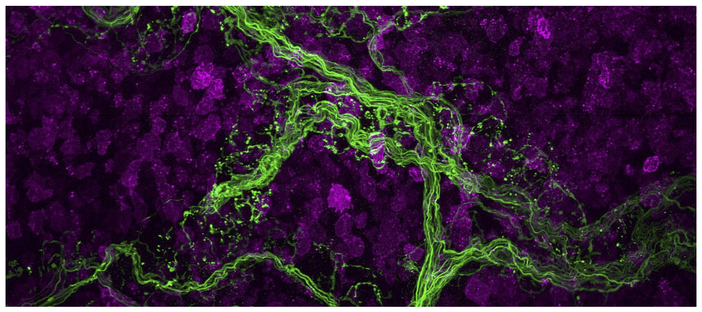
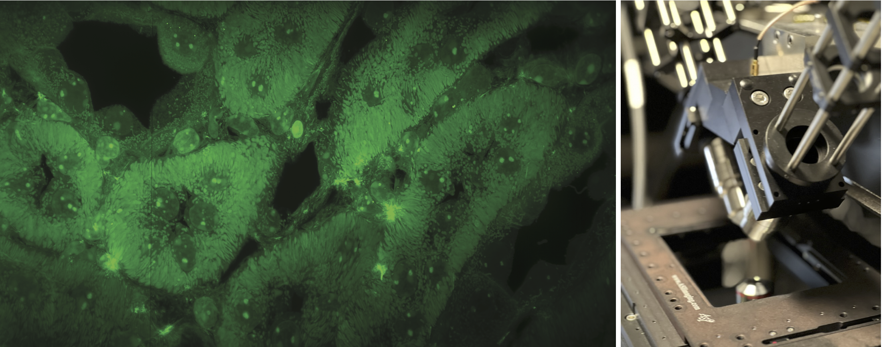

.. _implemented_microscopes:

===========================================
Implemented Microscopes
===========================================

As an example of the flexibility of the **navigate** software, we describe several microscope implementations that are currently in use with the software. Each of these implementations is described in the following sections, including a list of the equipment used and the configuration file used to operate the microscope. While this list does not aim to be comprehensive, it does show the diversity of microscopes that can be controlled using the **navigate** software. For example, this includes single and multi-camera systems, microscopes with different illumination and detection schemes, and microscopes with different sample geometries and scan mechanisms.

For more information on how to build these microscopes, as well as their performance, please refer to the publications listed in the relevant sections.

------------------

ASLM
****

*(Top) Collagen-embedded cells imaged with ASLM. Segmented cells shown on the left, and the corresponding raw data shown on the right. Data from Driscoll et al, Nat. Methods. 2019. Scale bars, 10 microns. (Bottom) images of the live-cell ASLM implementation.*

Axially Swept Light-Sheet Microscope (ASLM) is designed specifically to achieve high-resolution imaging throughout large fields of view. This custom-built system offers unparalleled resolution of 300-380 nm isotropically across extensive imaging volumes measuring up to 200x200x200 microns, employing one-photon excitation techniques.

The ASLM system features a Special Optics 28.5X/NA 0.67 illumination objective and a Nikon 25X/NA 1.1 detection objective. It is equipped with a diverse array of laser wavelengths including 445, 488, 514, 561, and 642 nm, enabling versatile multicolor imaging capabilities. The system leverages aberration-free remote focusing to scan the illumination beam in sync with the rolling shutters of two Hamamatsu Flash 4.0 sCMOS cameras. Because ASLM does not depend upon diffractive optics, such as spatial light modulators, it is capable of simultaneous multicolor imaging.

Unique to ASLM, the system maintains diffraction-limited and isotropic resolution over arbitrarily large volumes. The resulting point spread function (PSF) is isotropic, devoid of side lobes or significant blurring, obviating the need for deconvolution. Moreover, ASLM achieves significantly higher illumination uniformity compared to traditional Gaussian or Bessel beam approaches. This uniformity translates to a consistent signal-to-noise ratio (SNR) throughout the imaging volume, greatly enhancing quantitative imaging applications such as fluorescence resonance energy transfer and single particle tracking. This combination of features makes ASLM an exceptional tool for detailed, quantitative imaging across large sample volumes.

**Instrument Location**: The University of Texas Southwestern Medical Center, Dallas, TX

**Relevant Publications**:

* `Deconvolution-free subcellular imaging with axially swept light sheet microscopy <https://pubmed.ncbi.nlm.nih.gov/26083920/>`_
* `Diagonally scanned light-sheet microscopy for fast volumetric imaging of adherent cells <https://pubmed.ncbi.nlm.nih.gov/27028654/>`_
* `u-track3D: Measuring, navigating, and validating dense particle trajectories in three dimensions <https://pubmed.ncbi.nlm.nih.gov/38042149/>`_
* `Robust and automated detection of subcellular morphological motifs in 3D microscopy images <https://www.nature.com/articles/s41592-019-0539-z>`_

.. collapse:: Technical Information

    .. list-table::
       :widths: 25 75
       :header-rows: 1

       * - Equipment
         - Description
       * - Lasers
         - Coherent Obis with emission at 405, 457, 488, 514, 561, and 642 nm.
       * - Stages
         - MP-285, PI P-726 PIFOC High-Load piezo, and a galvo for acquisition of z-stacks.
       * - Stage Controllers
         - Sutter MP-285 and PI E-709
       * - Cameras
         - 2x Hamamatsu Flash 4.0
       * - Filter Wheel
         - Sutter Lambda 10-3 with 1x 25mm Filter Wheels
       * - Remote Focusing Units
         - Equipment Solutions LFA-2010 Linear Focus Actuator
       * - Data Acquisition Cards
         - National Instruments PCIe-6738
       * - Galvo
         - Novanta CRS 4 KHz Resonant Galvo
       * - Zoom
         - N/A
       * - Other
         - NA

    .. collapse:: Configuration File

        .. literalinclude:: configurations/configuration_voodoo.yaml
           :language: yaml

        |

------------------

Optical Tiling OPM
******************

.. image:: images/tiling_opm.png
   :width: 100%
   :align: center

*(Left) Image of a monolayer of keratinoctyes imaged with the Optical Tiling OPM. Region shown with a red box is magnified and shown through time below. (Right, top and bottom) Images of the Optical Tiling OPM system.*

The Oblique Plane Microscope (OPM) described here is engineered for high-resolution, fast volumetric imaging of large fluorescent samples, such as cell monolayers, spheroids, and zebrafish embryos. This system addresses the common challenge of achieving high spatiotemporal resolution throughout a large field of view, which is often restricted in OPM setups due to optics associated with the tertiary imaging system.

To overcome these constraints, the microscope incorporates a novel dual-axis scan unit, enabling rapid, high-resolution imaging across a volume of 800 × 500 × 200 microns. Furthermore, the system integrates a multi-perspective projection imaging technique, which significantly enhances the volumetric interrogation rate to over 10 Hz. This feature facilitates quick scanning across a large field of view in a dimensionally reduced format, allowing for the swift identification and detailed imaging of specific regions of interest.

The custom-built oblique plane microscope is built in an inverted geometry. Illumination is provided obliquely at a 40-degree angle using an Olympus 20X/NA 1.05 water immersion objective, and fluorescence is captured in an epi-fluorescence format by the same objective. The fluorescence signal is then relayed through an Olympus 20x/NA 0.8 secondary objective and redirected by a custom glass-tipped tertiary objective set at a 40-degree angle. Images are captured using a Hamamatsu Flash 4.0 sCMOS camera. Multi-well plate plate imaging is available through mechanical sample scanning.

**Instrument Location**: The University of Texas Southwestern Medical Center, Dallas, TX

**Relevant Publications**:

* `Increasing the field-of-view in oblique plane microscopy via optical tiling <https://pubmed.ncbi.nlm.nih.gov/36733723/>`_
* `A versatile oblique plane microscope for large-scale and high-resolution imaging of subcellular dynamics <https://elifesciences.org/articles/57681>`_

.. collapse:: Technical Information

    .. list-table::
       :widths: 25 75
       :header-rows: 1

       * - Equipment
         - Description
       * - Lasers
         - Coherent Galaxy with 488, 561, and 642 nm lasers.
       * - Stages
         - ASI FTP-2000 with MS-2000 XY stage, and a Galvo for acquisition of z-stacks.
       * - Stage Controllers
         - ASI Tiger Controller
       * - Cameras
         - Hamamatsu Flash 4.0
       * - Filter Wheel
         - 2x ASI 6-Position 32 mm Filter Wheels
       * - Remote Focusing Units
         - Optotune Electrotunable Lens (EL-16-40-TC-VIS-5D-1-C)
       * - Data Acquisition Cards
         - National Instruments PCIe-6738
       * - Galvo
         - Novanta CRS 4 KHz Resonant Galvo, and 2x Novanta Linear Galvos for shearing and tiling.
       * - Zoom
         - N/A
       * - Other
         - NA

    .. collapse:: Configuration File

        .. literalinclude:: configurations/configuration_OPMv2.yaml
           :language: yaml

    |

------------------

AO OPM
*******

*(Left) Images of zebrafish vasculature before and after application of sensorless adaptive optics. (Right) image of the OPM equipped with adaptive optics.*

Adaptive optics (AO) significantly enhances the performance of microscopes by restoring diffraction-limited imaging capabilities, particularly beneficial in light-sheet fluorescence microscopy (LSFM) where optical aberrations can vary significantly between the illumination and detection paths. To overcome these challenges, this oblique plane microscope includes a singular deformable mirror that effectively corrects aberrations in both the illumination and detection paths simultaneously. Aberrations are measured in a sensorless format on projection images, which stabilizes and refines wavefront corrections.

The custom-built OPM is optimized for zebrafish studies and incorporates a VAST BioImager Platform that automates zebrafish loading and positioning. Illumination is provided obliquely at 40 degrees using a Nikon 25X/NA 1.1 water immersion objective, and the collected fluorescence is processed using the same objective in an epi-fluorescence format. The signal is then relayed through an Olympus 20x/NA 0.8 secondary objective, directed by a custom glass-tipped tertiary objective at a 40-degree angle, and finally captured on a Hamamatsu Flash 4.0 sCMOS camera.

**Instrument Location**: The University of Texas Southwestern Medical Center, Dallas, TX

**Relevant Publications**:

* `Adaptive optics in an oblique plane microscope <https://pubmed.ncbi.nlm.nih.gov/38562744/>`_
* `Increasing the field-of-view in oblique plane microscopy via optical tiling <https://pubmed.ncbi.nlm.nih.gov/36733723/>`_
* `A versatile oblique plane microscope for large-scale and high-resolution imaging of subcellular dynamics <https://elifesciences.org/articles/57681>`_

.. collapse:: Technical Information

    .. list-table::
       :widths: 25 75
       :header-rows: 1

       * - Equipment
         - Description
       * - Lasers
         - Omicron LightHUB Ultra with 488 and 561 nm lasers.
       * - Stages
         - A piezo for adjusting the position of the tertiary objective, and a galvo for acquisition of z-stacks.
       * - Stage Controllers
         - N/A
       * - Cameras
         - Hamamatsu Flash 4.0
       * - Filter Wheel
         - N/A
       * - Remote Focusing Units
         - N/A
       * - Data Acquisition Cards
         - National Instruments PCIe-6738
       * - Galvo
         - Two Novanta galvos for shearing and lateral sweeping of the illumination beam.
       * - Zoom
         - N/A
       * - Other
         - VAST large object flow cytometry system and Imagine Optics deformable mirror for wavefront correction.
       * - Other
         - NA

    .. collapse:: Configuration File

        .. literalinclude:: configurations/configuration_OPMv3.yaml
           :language: yaml

    |

------------------

CT ASLM - v1
************

*Image of a CLARITY-cleared mouse hippocampus imaged with the CT ASLM. Specimen was placed in glycerol, which results in slight swelling of the specimen, thereby improving the imaging resolution.*

The Cleared Tissue Axially Swept Light-Sheet Microscope (CT ASLM) - Version 1 combines subcellular detail with tissue-scale anatomical views. This microscope provides an isotropic resolution of ~700 nm, which is provides insight into complex 3D morphologies in large tissue contexts. It achieves a field of view of 870 x 870 microns in water and 737 x 737 microns in BABB, and is equipped with NA 0.4 multi-immersion objectives from Applied Scientific Instrumentation. Illumination is provided with Coherent OBIS solid-state lasers with wavelengths of 405 nm, 488 nm, 561 nm, and 637 nm. Images are acquired with a Hamamatsu ORCA Flash 4.0 sCMOS camera. It is also equipped with a fast filter wheel and 3D motorized stage from Sutter Instruments, which enables tiling of large volumes. For acquisition of Z-stacks, the microscope uses a piezo stage from Mad City Labs.

**Instrument Location**: The University of Texas Southwestern Medical Center, Dallas, TX

**Relevant Publications**:

* `Isotropic imaging across spatial scales with axially swept light-sheet microscopy <https://www.nature.com/articles/s41596-022-00706-6>`_
* `Light-sheet microscopy of cleared tissues with isotropic, subcellular resolution <https://www.nature.com/articles/s41592-019-0615-4>`_

.. collapse:: Technical Information

    .. list-table::
       :widths: 25 75
       :header-rows: 1

       * - Equipment
         - Description
       * - Lasers
         - Coherent Obis lasers with emission at 488, 561, and 642 nm.
       * - Stages
         - MP-285 and Piezo Jena 200-micron piezo for acquisition of z-stacks via sample scanning.
       * - Stage Controllers
         - Sutter MP-285
       * - Cameras
         - Hamamatsu Flash 4.0
       * - Filter Wheel
         - Sutter Lambda 10-3 with 1x 25mm Filter Wheel
       * - Remote Focusing Units
         - Equipment Solutions LFA-2010 Linear Focus Actuator
       * - Data Acquisition Cards
         - National Instruments PCIe-6738
       * - Galvo
         - Novanta CRS 4 KHz Resonant Galvo
       * - Zoom
         - N/A
       * - Other
         - NA

    .. collapse:: Configuration File

        .. literalinclude:: configurations/configuration_ctaslmv1.yaml
           :language: yaml

    |

------------------

CT ASLM - v2
************

*Image of the peripheral nervous system in the hematopoietic stem cell niche. Nerves are shown in green, and hematopoietic progenitor cells in magenta.*

This microscope is engineered to achieve an isotropic resolution of 300 nm throughout a field of view of ~340 x 340 microns. It includes high-performance Coherent OBIS solid-state lasers at wavelengths of 488 nm, 561 nm, and 637 nm. Imaging is performed with a Hamamatsu ORCA Flash 4.0 sCMOS camera and a fast filter wheel from Sutter Instruments. The microscope is equipped with 2x NA 0.7 multi-immersion objectives from Applied Scientific Instrumentation. Sample positioning is handled by a Sutter Instruments 3D motorized stage, which supports the tiling of large volumes. Z-stacks are acquired with a 200-micron Piezosystem Jena stage.

**Instrument Location**: The University of Texas Southwestern Medical Center, Dallas, TX

**Relevant Publications**:

* `Isotropic imaging across spatial scales with axially swept light-sheet microscopy <https://www.nature.com/articles/s41596-022-00706-6>`_
* `Light-sheet microscopy of cleared tissues with isotropic, subcellular resolution <https://www.nature.com/articles/s41592-019-0615-4>`_

.. collapse:: Technical Information

    .. list-table::
       :widths: 25 75
       :header-rows: 1

       * - Equipment
         - Description
       * - Lasers
         - Coherent Obis lasers with emission at 405, 488, 561, and 642 nm.
       * - Stages
         - Sutter MP-285 and Mad City Lab 500-micron piezo for acquisition of z-stacks via sample scanning.
       * - Stage Controllers
         - Sutter MP-285
       * - Cameras
         - Hamamatsu Flash 4.0
       * - Filter Wheel
         - Sutter Lambda 10-3 with 1x 25mm Filter Wheel
       * - Remote Focusing Units
         - Equipment Solutions LFA-2010 Linear Focus Actuator
       * - Data Acquisition Cards
         - National Instruments PCIe-6738
       * - Galvo
         - Novanta CRS 4 KHz Resonant Galvo
       * - Zoom
         - N/A
       * - Other
         - NA

    .. collapse:: Configuration File

        .. literalinclude:: configurations/configuration_ctaslmv2.yaml
           :language: yaml

    |

------------------

Expansion ASLM
**************

*(Left) Image of an expanded liver section imaged with the Expansion ASLM. (Right) Image of the Expansion ASLM system.*

This upright variant of Axially Swept Light-Sheet Microscopy (ASLM) boasts a field of view that is 3.2 times larger than its predecessors, measuring 774 x 435 microns with a raw and isotropic resolution of approximately 420 nm. The upright sample geometry is advantageous for imaging fragile, expanded tissues, as well as samples that have large lateral extents. The system is equipped with an Omicron LightHub Ultra laser launch that features multiple fiber outputs and provides emission wavelengths at 405, 488, 561, and 642 nm. The microscope utilizes a high-sensitivity back-thinned Hamamatsu Lightning sCMOS camera and includes a fast filter wheel. Imaging is performed with 0.7 NA multi-immersion objectives and a FTP-2000 motorized stage from Applied Scientific Instrumentation. The microscope supports multiple imaging modes to accommodate different research needs. These include the classical step-and-settle routine, where the stage moves between image acquisitions. For large samples, the stage can operate at a constant velocity, with images captured at predetermined intervals, minimizing the latency typically associated with the step-and-settle method and improving throughput. Lastly, the microscope can operate in a mechanically sheared acquisition format, where two stages are scanned simultaneously. This approach aligns data automatically in its correct spatial context, significantly reducing the need for computational post-processing and eliminating data interpolation and duplication.

**Instrument Location**: The University of Texas Southwestern Medical Center, Dallas, TX

**Relevant Publications**:

* `Mechanically sheared Axially Swept Light-Sheet Microscopy <https://pubmed.ncbi.nlm.nih.gov/38645073/>`_
* `The mesoSPIM initiative: open-source light-sheet microscopes for imaging cleared tissue <https://www.nature.com/articles/s41592-019-0554-0>`_
* `Isotropic imaging across spatial scales with axially swept light-sheet microscopy <https://www.nature.com/articles/s41596-022-00706-6>`_
* `Light-sheet microscopy of cleared tissues with isotropic, subcellular resolution <https://www.nature.com/articles/s41592-019-0615-4>`_

.. collapse:: Technical Information

    .. list-table::
       :widths: 25 75
       :header-rows: 1

       * - Equipment
         - Description
       * - Lasers
         - Omicron LightHUB Ultra with 405, 488, 561, and 642 nm lasers.
       * - Stages
         - ASI FTP-2000 with Linear Encoders in X and Y, and 3x LS-50 Linear Stages
       * - Stage Controllers
         - ASI Tiger Controller
       * - Cameras
         - Hamamatsu Lightning and Photometrics Iris15
       * - Filter Wheel
         - 2x ASI 6-Position 32 mm Filter Wheels
       * - Remote Focusing Units
         - ThorLabs BLINK
       * - Data Acquisition Cards
         - National Instruments PXIe-1073 chassis equipped with PXI6733 and PXI6259
       * - Galvo
         - Novanta CRS 4 KHz Resonant Galvo
       * - Zoom
         - N/A
       * - Other
         - NA

    .. collapse:: Configuration File

        .. literalinclude:: configurations/configuration_upright.yaml
           :language: yaml

    |

----------------